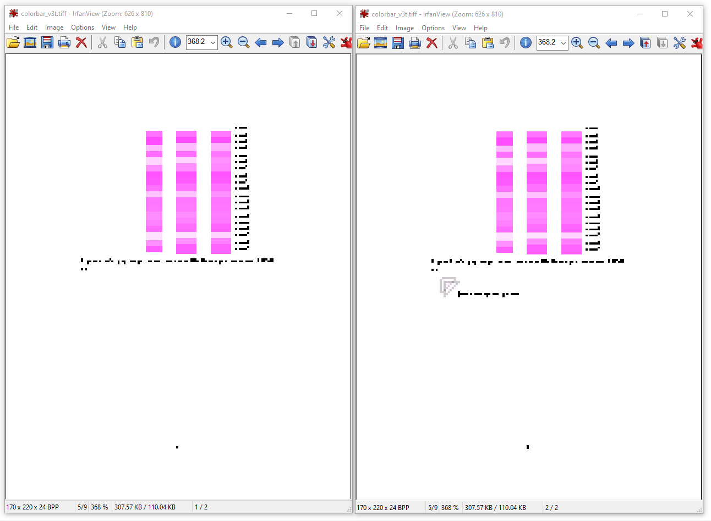

A while ago, I've performed some related experiments, trying to get how color management works in Ghostscript 9.27 for pdf output.
This gist aims to provide some reproducible examples of gs behaviour.


Input pdf
---------
The example input used here is a simple pdf (no built-in profiles), that contains:
* Page 1:
  * Column1 is RGB image (DeviceRGB = no built-in profile, no colorimetrically defined colorspace)
  * Column2 is a set of a table cells filled with the same RGB colors
  * Column3 is a set of a table cells filled with somewhat-close CMYK colors (converted as sRGB->RSWOP)
* Page 2
  * all the same
  * small transparent tikz pic

  
Here's how it looks like:  


Notes:
 * Its source tex code is [attached](tex) ([same in overleaf](https://www.overleaf.com/read/bvkfbwhqzbtp)).
 * Built with XeLaTeX from TexLive 2018.
 * The arrow shows the point, where I click to make `Output Preview -> Object Inspector` show something.  


Other inputs
------------
For these experiments, I also use (included in this repo as well):
 * The [cmyk_des_renderintent.icc](http://git.ghostscript.com/?p=ghostpdl.git;a=blob_plain;f=toolbin/color/src_color/cmyk_des_renderintent.icc;hb=d3537a54740d78c5895ec83694a07b3e4f616f61)
   profile, that is very useful for debugging - as documented in ["Ghostscript 9.21 Color Management"](https://www.ghostscript.com/doc/9.27/GS9_Color_Management.pdf), 
 from the Ghostscript repo is quite handy for experiments like this. 
 It is designed such that different intents output different colors:
   * the "Perceptual" rendering intent (0) outputs cyan only, 
   * the "RelativeColorimetric" intent (1) outputs magenta only 
   * and "Saturation" intent (2) outputs yellow only. 
 * [gs/lib/PDFX_def.ps](http://git.ghostscript.com/?p=ghostpdl.git;a=blob;f=lib/PDFX_def.ps;h=4c34d06de08a33fa7afd734feb833944e968c4ff;hb=refs/heads/gs9.26) 
 from the Ghostscript repo, modified to utilize `cmyk_des_renderintent.icc`. A prefix file for creating a PDF/X-3.


Types of built-in profiles
--------------------------
At least two things that might be called "embedded profile":

  1) whole-file "Output intent profile" (used in PDF/X-3)
  2) object-specific ICC based colorspace, defined via a profile (e.g. in embedded sRGB image)   


Summary
-------

|exp|output|PDF/X-3|sColorConversionStrategy|dProcessColorModel|sOutputICCProfile   |
|---|:---:|:---:|--------------------------|------------|---------------------------|
|1  | pdf | Y   | UseDeviceIndependentColor| DeviceCMYK | cmyk_des_renderintent.icc |
|2  | pdf | Y   | CMYK                     | DeviceCMYK | cmyk_des_renderintent.icc |
|3  | pdf | N   | CMYK                     | DeviceCMYK | cmyk_des_renderintent.icc |
|3t | tiff| N   | CMYK                     | DeviceCMYK | cmyk_des_renderintent.icc |
|4  | pdf | N   | UseDeviceIndependentColor| \<none\>   | \<none\>                  |
|5  | pdf | N   | UseDeviceIndependentColor| DeviceCMYK | cmyk_des_renderintent.icc |


Exp 1
-----

Ghostscript (9.12-9.27, not sure about earlier) [supports PDF/X-3 output](https://www.ghostscript.com/doc/9.27/VectorDevices.htm#PDFX).
As a part of it, there is a possibility to embed an "output intent" icc profile.

Let's start from the following (same in `conv_v1.bat`):
 ```
 gswin64c -dPDFX -dBATCH -dNOPAUSE -dHaveTransparency=false -r20 -dProcessColorModel=/DeviceCMYK -sColorConversionStrategy=UseDeviceIndependentColor  -sDefaultRGBProfile="default_rgb.icc" -sOutputICCProfile="cmyk_des_renderintent.icc" -dRenderIntent=1 -dDefaultRenderingIntent=/Perceptual -sDEVICE=pdfwrite -sOutputFile=colorbar_v1.pdf PDFX_IntCmyk.ps Colorbar.pdf
 ```
 Here's how the same file looks in Foxit reader 9.5 (it ignores output intent):
 
 

 Here's how resulting "colorbar_v1.pdf" looks like this in Adobe Acrobat DC (it takes output intent into account):
 
 

Since the same file looks different in two different viewers, it is clear that the "Output Intent" icc profile is
applied by the viewer, during pdf rendering. 
The output intent profile is also visible in Adobe Preflight:

 
 
Few more details about what's actually happening here:
 * `gswin64c` is for windows CLI-only version of the gs. Use just `gs` on linux (the rest is the same).
 * `-dHaveTransparency=false` makes sure that the 2nd page would get rasterized (due to presence of a tikz pic with transparency)
 * ` -r20` makes sure rasterization would be clearly visible (due to just 20dpi)
 * `-sOutputICCProfile="cmyk_des_renderintent.icc" -dRenderIntent=1` makes rasterizer produce magenta output.
    * This demonstrates that some color conversion is possible, but... only where rasterization happens. 
 (Compare with Exp3t) 
    * Note that `OutputICCProfile` parameter is not mentioned in [current docs](https://www.ghostscript.com/doc/current/VectorDevices.htm), 
    since [ this](https://bugs.ghostscript.com/show_bug.cgi?id=700931#c3) ([9.27 docs](https://www.ghostscript.com/doc/9.27/VectorDevices.htm#PDFX) are a bit outdated).  
    * `RenderIntent` is also undocumented. Also only affects rasterization. 
    This is why second page is in magenta in Foxit (see "Other inputs" section).
 * `-dDefaultRenderingIntent=/Perceptual` puts said intent to metadata (without touching any stored color values), so that Acrobat would draw everything in cyan
 * `-dProcessColorModel=/DeviceCMYK` is required, but must be `cmyk` due to `-sOutputICCProfile="cmyk_des_renderintent.icc"`. 
    When `-sColorConversionStrategy=UseDeviceIndependentColor` it only controls whether the second page would 
    be `ICCBasedRGB` or `ICCBasedCMYK` (if we drop conflicting options). 
    This would slightly affect colors we get there.
 * `-sDefaultRGBProfile="default_rgb.icc"` is a placeholder for possible experiments with input icc profiles 
    (same default is set if this parameter is omitted).
    

 
 
 
Exp 2 (CMYK)
------------

The following is a naive modification of the first command, attempring to convert everything to CMYK (same in `conv_v2.bat`):
```
gswin64c -dPDFX -dBATCH -dNOPAUSE -dHaveTransparency=false -r20 -dProcessColorModel=/DeviceCMYK -sColorConversionStrategy=CMYK -sDefaultRGBProfile="default_rgb.icc" -sOutputICCProfile="cmyk_des_renderintent.icc" -dRenderIntent=1 -dDefaultRenderingIntent=/Perceptual -sDEVICE=pdfwrite -sOutputFile=colorbar_v2.pdf PDFX_IntCmyk.ps Colorbar.pdf
```
This produces a very different result - now there's just some "saturation adjustment" visible in both Acrobat (more saturated) and Foxit (less saturated).
(I'm not sure how exactly to interpret this.)

Note that `dProcessColorModel` is still required here (despite of [note 6](https://www.ghostscript.com/doc/9.27/VectorDevices.htm#note_6)), see [this](https://bugs.ghostscript.com/show_bug.cgi?id=700930#c3).

Foxit:

Acrobat:


Exp 3 (CMYK, not PDF/X-3)
-------------------------
Now we know the effect of the `PDFX_IntCmyk.ps`. Let's check the result without it (same in `conv_v3.bat`):
```
gswin64c -dBATCH -dNOPAUSE -dHaveTransparency=false -r20 -dProcessColorModel=/DeviceCMYK -sColorConversionStrategy=CMYK -sDefaultRGBProfile="default_rgb.icc" -sOutputICCProfile="cmyk_des_renderintent.icc" -dRenderIntent=1 -dDefaultRenderingIntent=/Perceptual -sDEVICE=pdfwrite -sOutputFile=colorbar_v3.pdf Colorbar.pdf
```

Foxit:

Acrobat:


Acrobat now shows the same as Foxit - now there's no "output intent" profile.
Both results now look much like the original, even the rasterized part (except for low-res). The `sOutputICCProfile` has no effect. 


Exp 3t (CMYK, not PDF/X-3, tiff)
--------------------------------

Now, let's do the same for `tiff` output, where `-sOutputICCProfile` is honored (same in `conv_v3t.bat`):
```
gswin64c -dBATCH -dNOPAUSE -dHaveTransparency=false -r20 -dProcessColorModel=/DeviceCMYK -sColorConversionStrategy=CMYK -sDefaultRGBProfile="default_rgb.icc" -sOutputICCProfile="cmyk_des_renderintent.icc" -dRenderIntent=1 -dDefaultRenderingIntent=/Perceptual -sDEVICE=tiff32nc -sOutputFile=colorbar_v3t.tiff Colorbar.pdf
```

We get two-page tiff file, with both pages in magenta. 



Exp 4 (just ICCBased)
---------------------
Just for reference, let's convert to "DeviceIndepentent" (ICCBased) colors, without mentioning any output profiles: 
```
gswin64c -dBATCH -dNOPAUSE -dHaveTransparency=false -r20 -sColorConversionStrategy=UseDeviceIndependentColor -sDefaultRGBProfile="default_rgb.icc" -dRenderIntent=1 -dDefaultRenderingIntent=/Perceptual -sDEVICE=pdfwrite -sOutputFile=colorbar_v4.pdf Colorbar.pdf
```
Foxit:

Acrobat:


Exp 5 (not PDF/X-3)
-------------------
Like (1), but without PDF/X-3:
```
gswin64c -dBATCH -dNOPAUSE -dHaveTransparency=false -r20 -dProcessColorModel=/DeviceCMYK -sColorConversionStrategy=UseDeviceIndependentColor  -sDefaultRGBProfile="default_rgb.icc" -sOutputICCProfile="cmyk_des_renderintent.icc" -dRenderIntent=1 -dDefaultRenderingIntent=/Perceptual -sDEVICE=pdfwrite -sOutputFile=colorbar_v5.pdf Colorbar.pdf
```
Foxit:

Acrobat:


Exp AA1 (Acrobat, embed profile)
------------------------------
Adobe Acrobat (`Tools -> Print Production -> Convert Colors`) provides the following options:


Which produces the following result. <br>
Foxit:

Acrobat:


Exp AA2 (Acrobat, not embed profile)
------------------------------------
Now, let's try to not embed the profile:


This produces the following result. <br>
Foxit:

Acrobat:


Conclusion
----------

* `-sColorConversionStrategy=UseDeviceIndependentColor` converts your colors to `ICCBasedRGB`/`ICCBasedCMYK`.
   * This makes colors "colorimetrically defined", and means that "*some* icc profile is embedded" (see Adobe Preflight screenshots, especially in Exp 4). 
   * The "how are colors converted?" and "how do I adjust parameters of this conversion?" are, in a general case, far trickier questions.
   * Acrobat embeds the profile, selected by user and actually converts colors using it. Ghostscript is unable to do that.
* The "Output intent profile" works as expected. AFAIU, it requires `-sColorConversionStrategy=UseDeviceIndependentColor`.
* The `-sOutputICCProfile=` does not work for pdf the way it works for tiff. It is undocumented. <br>
  (But it still affects pages being rasterized, when converting to DeviceIndependent colors. Not sure if it's a bug or a feature.)
* There's no simple way to, say, avoid color clipping (by specifying intent), when converting from `DeviceRGB` to `DeviceCMYK`.
  Acrobat, with "embed profile" unchecked, allows to produce a file, with colors converted. Ghostscript is unable to do that.   

Docs say, that only a small subset of color management options [is supported](http://git.ghostscript.com/?p=ghostpdl.git;a=blob;f=doc/VectorDevices.htm;h=c939fddfa3f59bf73023f904b7e8d0c7e27729ff;hb=refs/heads/master#l566) for pdf output.
You can only set default input color profile (e.g. for objects that do not have a profile), but you cannot set: output ICC profile, black generation options, etc.


Final notes
-----------
* gs simply ignores unknown switches.

* icc profiles contain independent `local_value->ICC` and `ICC->local_value` tables. 
  Compare `cmyk_des_renderintent.icc` and `cmyk_src_renderintent.icc` from [this folder](http://git.ghostscript.com/?p=ghostpdl.git;a=tree;f=toolbin/color/src_color;h=44d1d659f24431c185dab2af5ce325ec272cca46;hb=ebfaa2db4cb518a2bc99c1532d4429201a13dfab) (e.g. with [ICC Profile Inspector](http://www.color.org/profileinspector.xalter)).      
* [Docs](https://www.ghostscript.com/doc/9.27/VectorDevices.htm) say:
   > DeviceRGB color values are passed unchanged. If a user needs a non trivial color adjustment, a non trivial DefaultRGB color space must be defined. Transfer functions and halftone phases are skipped.
   
  * The first two sentences here are probably be related to file in [gs\Resource\ColorSpace\DefaultRGB](http://git.ghostscript.com/?p=ghostpdl.git;a=tree;f=Resource/ColorSpace;h=59a3bddf85029ed31e44394f116ae7d77dce6943;hb=ebfaa2db4cb518a2bc99c1532d4429201a13dfab) folder.
 This might be the clue to at least some limited color management capabilities for related color conversions. I've never tried that.
  * The last sentence is probably the one that explains why we see no color conversions (nothing like what Acrobat produces)
  * In the docs, this phrase seem to be related to `-dPDFX`, while, actually, it seem to be true for all cases.
    